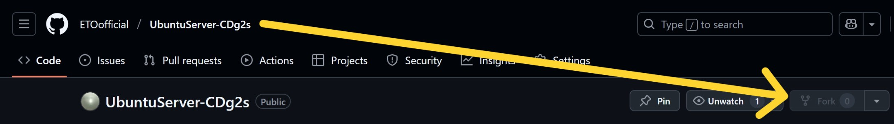
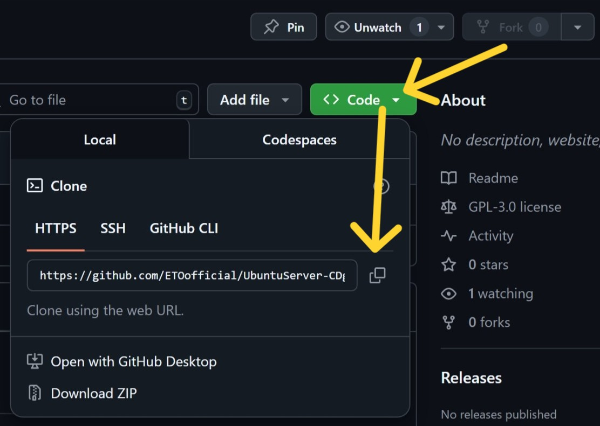

# 如何为项目做贡献

## 开始之前

- 查看 [Issues](https://github.com/ETOofficial/UbuntuServer-CDg2s/issues) 寻找可以参与的任务，或创建新 Issue 讨论您的想法。

## 贡献流程

### 报告问题

1. 在提交 Issue 前，请先搜索是否已有相关 Issue
2. 使用提供的 Issue 模板（如果存在）
3. 包含以下信息：
   - 清晰的问题描述
   - 复现步骤
   - 预期与实际行为对比
   - 相关日志/截图（如果存在）

### 提交代码

1. **Fork 仓库并克隆到本地**

    

    Fork 仓库之后，对你自己的仓库，克隆到你本地的 Ubuntu Server 上：

    

    cd 到你准备好的目录，然后执行：

    ```bash
    git clone https://github.com/你的用户名/项目名称.git
    ```

    如果提示 git 命令未找到，请先执行：

    ```bash
    sudo apt-get install git
    ```

2. **创建你的分支，并遵循[分支命名规则](#分支命名规则)**

    ```bash
    git checkout -b feat/your-feat-name
    # 或
    git checkout -b fix/issue-number-desc
    ```

3. **遵循项目代码风格进行编写**
4. **提交更改，使用 [Angular](#Angular) 规范提交信息**

   ```bash
   git commit -m "<type>(scope): <subject>"
   ```

5. **推送分支到你的 Fork**

   ```bash
   git push origin your-branch
   ```

6. **创建 Pull Request**
   - 指向**上游**仓库的分支
   - 详细填写 PR 信息
   - 关联 Issue（如果存在）

---

## 补充说明

<a id="分支命名规则"></a>

### 分支命名规则

#### 一、核心分支类型及命名规范

1. **主干分支（Main Branches）**
   - `main`: 生产环境稳定代码
   - `dev`: 集成最新开发成果的持续集成分支

2. **支持性分支（Supporting Branches）**
   - **功能开发分支**
     - 格式：`feature/<issue-id>-<short-description>`
     - 示例：`feature/PROJ-42-user-auth-flow`

   - **热修复分支**
     - 格式：`hotfix/<issue-id>-<description>`
     - 示例：`hotfix/PROJ-65-login-css-fix`

   - **版本发布分支**
     - 格式：`release/<semantic-version>`
     - 示例：`release/v2.1.0-rc`

#### 二、高级命名规范

1. **结构化元素**

   ```bash
   <branch-type>/<scope>/<ticket-id>-<kebab-case-description>
   ```

   示例：`feat/auth/CLD-15-oauth2-integration`

2. **环境专用分支**
   - `env/staging`: 预发布环境分支
   - `env/performance`: 性能测试专用分支

3. **自动化分支**
   - `dependabot/<package-manager>/<package-name>`: 依赖更新分支
   - `gh-actions/<workflow-name>`: CI/CD 流水线分支

#### 三、技术规范要求

1. **字符规范**
   - 仅允许：小写字母（a-z）、数字（0-9）、连字符（-）
   - 禁止：空格、特殊字符（@$%^&）、下划线（_）

2. **长度控制**
   - 建议：8-50个字符（Git 限制：255字节）
   - 使用缩写策略：`config` → `cfg`, `authentication` → `auth`

3. **语义化版本**
   - 遵循 `major.minor.patch` 格式
   - 预发布标识：`v1.2.3-beta.1`

---

<a id="Angular"></a>

### Git 提交规范（Angular Commit Message）

遵循 Angular 团队的提交信息格式，便于生成 Change Log 和代码追溯。

#### 1. **提交格式**

```plaintext
<type>(<scope>): <subject>
<BLANK LINE>
<body>
<BLANK LINE>
<footer>
```

- **Header**（必需）：
  - `type`：提交类型（如 `feat`、`fix`、`docs`）。
  - `scope`：影响范围（如模块名）。
  - `subject`：简短描述（动词开头，如 `add user login`）。
- **Body**（可选）：详细说明变更动机和实现细节。
- **Footer**（可选）：标记破坏性变更（`BREAKING CHANGE`）或关闭的 Issue（`Closes #123`）。

#### 2. **类型说明**

| 类型     | 说明                          |
|----------|-------------------------------|
| `feat`   | 新增功能                      |
| `fix`    | 修复 Bug                      |
| `docs`   | 文档变更                      |
| `style`  | 代码格式调整（如空格、分号）  |
| `refactor` | 重构代码（非功能或 Bug 修复） |
| `test`   | 添加或修改测试                |
| `chore`  | 构建工具或依赖变更            |

#### 3. **示例**

```plaintext
feat(auth): add OAuth2 login support

- Integrate Google and GitHub OAuth2 providers
- Update user model to store OAuth tokens

Closes #45
BREAKING CHANGE: Removed legacy login API endpoints.
```
